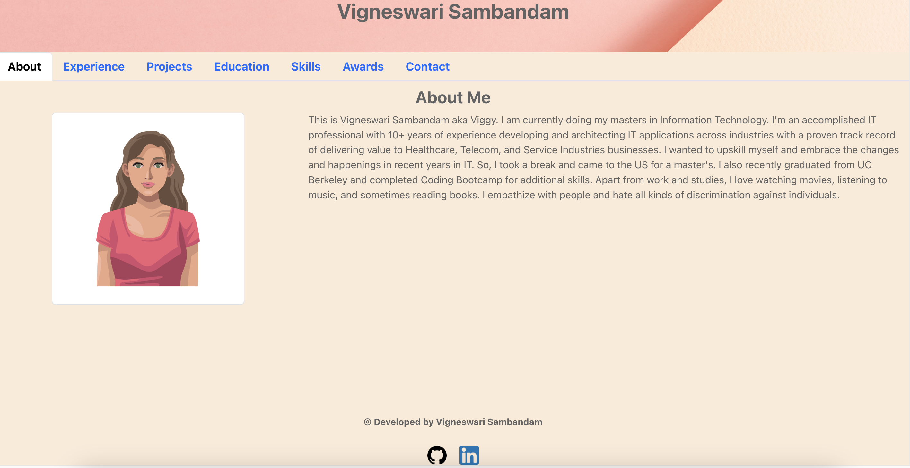
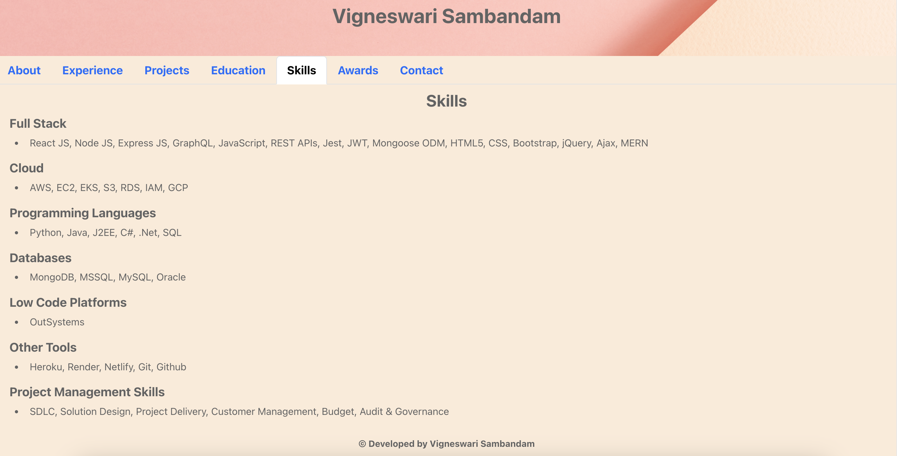

# vigneswariPortfolio

## Description
This is my portfolio website developed in React JS using Vite, Bootstrap, and React Bootstrap. This single-page application works well on various screens, including laptops, tablets, and mobile.

## Installation

To run or execute the application locally, one must have node installed in the system and other supporting packages mentioned in the package.json file.

To install Node.js, follow the guidelines mentioned in the link: https://nodejs.org/en/learn/getting-started/how-to-install-nodejs, 

## Usage

The deployed application can be accessed using the link 

The application source code can be accessed using the link https://github.com/Vigneshwarie/vigneswariPortfolio

One can download the code from the above link. To use the application, one must install node.js, which is mentioned in the installation section. Open the package.json file in the integrated terminal of the vscode, and use the npm install command to install the other required supporting packages. To run the application, use the "npm run dev" command for the application to start on localhost.

On successful installation and execution, the application will run successfully and starts listening to the port. One can navigate to the browser and type localhost for the mentioned port. The application will display as below.

## Credits

The below links on react bootstrap documentation were useful in understanding the usage of the components

https://react-bootstrap.netlify.app/docs/layout/grid

https://react-bootstrap.netlify.app/docs/forms/form-control

https://react-bootstrap.netlify.app/docs/components/images

https://react-bootstrap.netlify.app/docs/components/tabs

Avatar and Icons - https://www.vecteezy.com/

Application Logos - https://www.freelogodesign.org/ 

## License

Please refer to the LICENSE in the repo.

